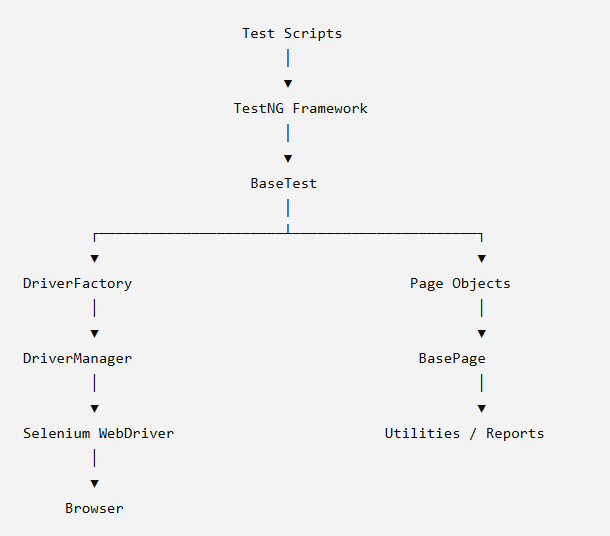
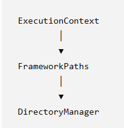
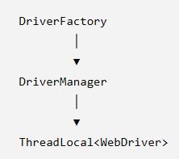
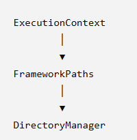
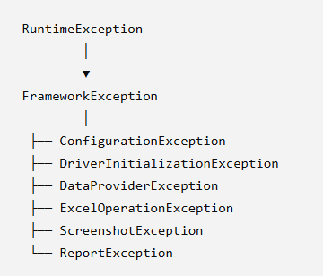

# UAF (Unified Automation Framework)

**Version:** 2.0

---

# 1. Introduction

## Purpose

UAF (Unified Automation Framework) is a scalable, modular, and enterprise-grade test automation framework developed using Java, Selenium WebDriver, TestNG, Maven, and Log4j2.

The framework is designed to automate UI testing while following software engineering best practices such as SOLID principles, Page Object Model (POM), ThreadLocal driver management, centralized configuration, reusable utilities, and layered architecture.

Rather than focusing only on test automation, UAF is designed as a reusable automation platform that can be extended in the future for API testing, Database validation, Selenium Grid, Docker execution, cloud execution, AI-assisted testing, and mobile automation.

---

# 2. Framework Objectives

The primary objectives of UAF are:

- Develop a maintainable automation framework.
- Eliminate code duplication.
- Follow SOLID principles.
- Support parallel execution.
- Centralize configuration and framework infrastructure.
- Produce rich execution reports.
- Keep test scripts readable and business-focused.
- Build reusable utilities that can be shared across projects.
- Prepare the framework for future expansion.

---

# 3. Guiding Principles

UAF is built on the following engineering principles:

- Simplicity over unnecessary abstraction.
- Reusability over duplication.
- Composition where appropriate.
- Clear separation of concerns.
- One responsibility per class.
- Enterprise-ready coding standards.
- Cross-platform compatibility.

# 4. High-Level Architecture

---

# 5. Framework Layers

UAF is divided into multiple independent layers.

## Test Layer

Contains all business test scenarios.

Responsibilities

- Business flow
- Assertions
- Test data usage

Test classes never contain Selenium locators or reusable framework logic.

---

## Page Layer

Implements the Page Object Model.

Responsibilities

- Web element locators
- Page-specific operations
- User interactions

Assertions are intentionally avoided inside Page Objects to maintain separation between UI interaction and business validation.

---

## Framework Layer

Provides reusable framework services.

Examples

- Driver Management
- Configuration
- Reporting
- Utilities
- Exception Handling
- Directory Management

This layer is independent of application-specific functionality.

---

## Selenium Layer

Contains Selenium WebDriver interaction.

Responsibilities

- Browser automation
- Element interaction
- Navigation
- Waits

The Selenium layer remains hidden from the test layer through Page Objects and BasePage.

---

# 6. Core Framework Infrastructure

The framework infrastructure is responsible for execution metadata and centralized path management.

## ExecutionContext

Stores execution-specific information.

Responsibilities

- Execution Identifier
- Execution Start Time

## FrameworkPaths

Provides centralized framework paths.

Responsibilities

- Execution directory
- Screenshot directory
- Log directory
- Download directory
- Resource directory

No class creates framework paths directly.

## DirectoryManager

Responsible for creating required execution directories before framework execution.

---

# 7. Driver Architecture

## DriverFactory

Responsibilities

- Browser initialization
- Browser selection
- Browser options
- Page load timeout configuration

Uses the Factory Design Pattern.

## DriverManager

Stores ThreadLocal WebDriver instances.

Responsibilities

- Store driver
- Retrieve driver
- Remove driver

This enables parallel execution without thread interference.

---

# 8. Reporting Architecture

Responsibilities

- Report initialization
- Step logging
- Screenshot attachment
- Report flushing

Report generation is completely independent from environment configuration.

---

# 9. Exception Architecture

Each framework layer throws its own exception, making failures easier to understand and debug.

---

# 10. Thread Safety

UAF supports parallel execution through ThreadLocal WebDriver.

Each executing thread receives its own independent browser instance.

Benefits

- No shared WebDriver
- No data collision
- Improved execution stability
- Parallel execution support

---

# 11. Design Patterns

| Pattern | Purpose |
|----------|---------|
| Factory | Driver creation |
| Singleton | ExtentManager |
| Page Object Model | UI abstraction |
| Fluent Interface | Method chaining |
| Utility | Framework helper classes |
| Holder | DriverManager |

---

# 12. SOLID Principles

UAF follows SOLID principles wherever applicable.

## Single Responsibility Principle

Examples

- DriverFactory → Creates drivers only.
- DriverManager → Stores drivers only.
- DirectoryManager → Creates directories only.
- FrameworkPaths → Provides framework paths only.

## Open/Closed Principle

The framework is open for extension while remaining closed for modification.

Example

New browser support can be added without modifying test classes.

## Dependency Inversion Principle

Business tests depend on Page Objects rather than Selenium implementation details.

---

# 13. Future Roadmap

The current implementation focuses on UI Automation.

The architecture has been intentionally designed for future support of:

- REST API Automation
- Database Validation
- Selenium Grid
- Docker Execution
- BrowserStack
- Sauce Labs
- Mobile Automation
- AI-assisted Test Automation

The modular design allows these capabilities to be integrated without major architectural changes.

---

# 14. Non-Goals

The current version of UAF does not aim to provide:

- Self-healing locators
- BDD support (Cucumber)
- Mobile automation
- Distributed Grid execution
- AI-generated test cases

These capabilities are planned for future releases.

# Version History

| Version | Description |
|----------|-------------|
| 1.0 | Initial assignment framework |
| 2.0 | Enterprise architecture refactoring |

# Conclusion

UAF is designed as an enterprise automation platform rather than a collection of Selenium test scripts.

The framework emphasizes maintainability, scalability, modularity, and clean architecture while keeping business test scripts simple, readable, and independent of framework implementation details.